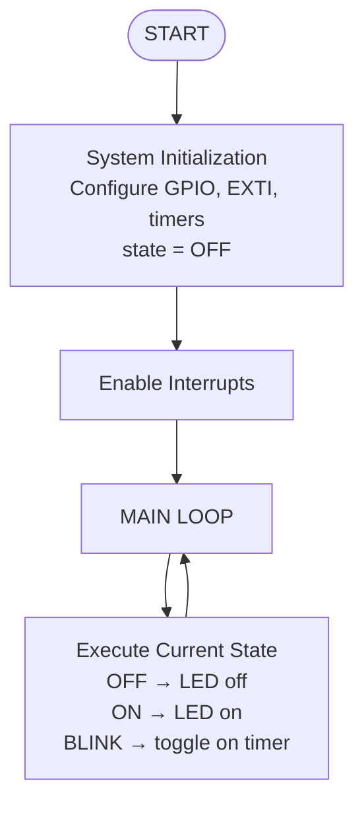
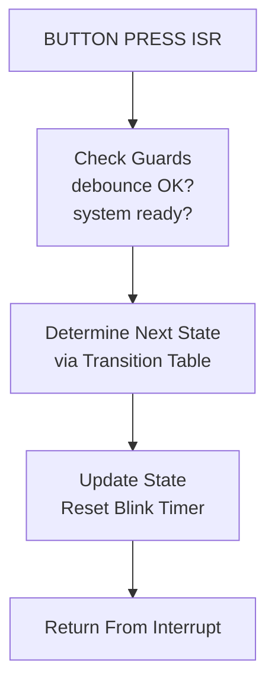
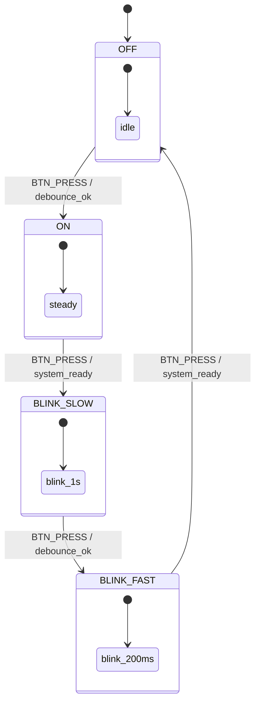

# STM32 LED Control State Machine


Interrupt‑Driven Input • Non‑Blocking LED Logic • Modular Architecture

---

## Features
- Interrupt‑driven button input using EXTI  
- Non‑blocking LED timing logic (no HAL_Delay)  
- Clean finite‑state machine with guard conditions  
- Modular architecture split into 4 logical components  
- Easy to extend with new states or behaviors  

---

## System Components

### Hardware Configuration
- Configured **PC13** as external interrupt (**EXTI13**) on falling edge for the user button  
- Enabled **NVIC interrupt line EXTI15_10_IRQn**  
- Configured **PB13** as output for the user LED  

---

## Project Structure

We organize the firmware into **4 modules**, each with a `.c` and `.h` file:

- **app** – central application logic  
- **state_machine** – all state logic and transitions  
- **button** – button handling + EXTI interrupt  
- **led** – LED control and timing  

This keeps the code clean, testable, and easy to extend.

---

## File Layout

## 📁 Project Structure

    App
    ├── Inc
    │   ├── hal_wrapper.h
    │   ├── state_machine.h
    │   
    └── Src
        ├── hal_wrapper.c
        ├── state_machine.c

---

## Module Explanations

### **app module**
- Acts as the central entry point of the firmware  
- Initializes hardware, configures GPIO, EXTI, and timers  
- Initializes all other modules (button, LED, state machine)  
- Runs the main application loop  
- Delegates behavior to the state machine without blocking  
- Ensures the system remains responsive at all times  

### **state_machine module**
- Contains the full state transition table  
- Defines actions for each state (OFF, ON, BLINK_SLOW, BLINK_FAST)  
- Evaluates guard conditions such as debounce and system readiness  
- Handles event dispatching from the button module  
- Provides a clean abstraction for system behavior  
- Ensures transitions remain predictable and testable  

### **button module**
- Configures PC13 as EXTI13 input on falling edge  
- Implements HAL_GPIO_EXTI_Callback to capture button events  
- Handles debouncing and event filtering  
- Exposes clean events to the state machine (e.g., BTN_PRESS)  
- Keeps interrupt logic isolated from application logic  
- Ensures button handling is reliable and modular  

### **led module**
- Controls PB13 LED output (ON, OFF, toggle)  
- Implements non‑blocking timing for blinking  
- Abstracts hardware access behind simple functions  
- Allows the state machine to request LED behavior without delays  
- Maintains internal timing state for blink intervals  
- Keeps LED logic independent from the rest of the system  

---

## Logic Flowchart



---

## Interrupt Handling Flow



---

## State Machine Diagram



---

## Pseudocode (Simplified, Clean, Copy‑Friendly)

```
states = [OFF, ON, BLINK_SLOW, BLINK_FAST]
current_state = OFF
last_toggle_time = now()
led_state = OFF

function timer_expired(interval):
    return (now() - last_toggle_time) >= interval

function action_off():
    led_state = OFF

function action_on():
    led_state = ON

function action_blink(interval):
    if timer_expired(interval):
        led_state = NOT led_state
        last_toggle_time = now()

actions = {
    OFF:        action_off,
    ON:         action_on,
    BLINK_SLOW: () => action_blink(1000),
    BLINK_FAST: () => action_blink(200)
}

transitions = [
    (OFF,        "BTN_PRESS", debounce_ok, ON),
    (ON,         "BTN_PRESS", system_ready, BLINK_SLOW),
    (BLINK_SLOW, "BTN_PRESS", debounce_ok, BLINK_FAST),
    (BLINK_FAST, "BTN_PRESS", system_ready, OFF)
]

function next_state(current, event):
    for each (state, input, guard, target) in transitions:
        if state == current AND input == event AND guard():
            return target
    return current

interrupt BUTTON_PRESS:
    new_state = next_state(current_state, "BTN_PRESS")
    if new_state != current_state:
        current_state = new_state
        last_toggle_time = now()

main loop:
    actions[current_state]()
```

---

## How It Works

The system uses:

- **EXTI interrupts** to detect button presses  
- **Guard conditions** to validate transitions  
- **A clean transition table** to determine next states  
- **Non‑blocking timing** to blink LEDs without delays  
- **A main loop** that only executes the action of the current state  

This keeps the firmware responsive, modular, and easy to extend.

---

## Testing (TDD Approach)

This project follows a **Test‑Driven Development (TDD)** workflow to ensure each module remains predictable, isolated, and easy to extend.

### TDD Workflow
1. **Write a failing test** for a new behavior (state transition, debounce rule, LED timing).
2. **Implement the minimal code** required to make the test pass.
3. **Refactor** while keeping all tests green.
4. **Repeat** for each new state, event, or timing rule.

This approach ensures the state machine evolves safely and remains fully testable.

### Test Directory Structure
Tests mirror the module layout to keep responsibilities clear:

    Tests
    ├── unit_tests.exe
    │
    ├── Fakes
    │   └── Src
    │       ├── fake_hal.c
    │       └── fake_hal.h
    │
    ├── Unit
    │   └── Src
    │       ├── test_state_machine.c
    │       └── test_state_machine.h
    │
    └── Unity
        └── Src
            ├── unity.c
            └── unity.h


### Unit Test Suite (Current Focus)
The initial suite validates each module **in isolation**:
- State transition logic  
- Guard conditions (debounce, readiness)  
- LED timing behavior  
- Button event generation  

These tests provide a solid foundation before introducing system‑level checks.

### Integration Tests (Future Extension)
Once the unit suite is stable, it will be extended with integration tests covering the full event pipeline:

    EXTI interrupt → button module → state machine → LED behavior

This ensures the system behaves correctly under real execution conditions.

---

## Next Steps
- Extend the state machine to include additional states
- Introduce UART debug output to monitor system behavior
- Implement integration tests for system‑level behavior
