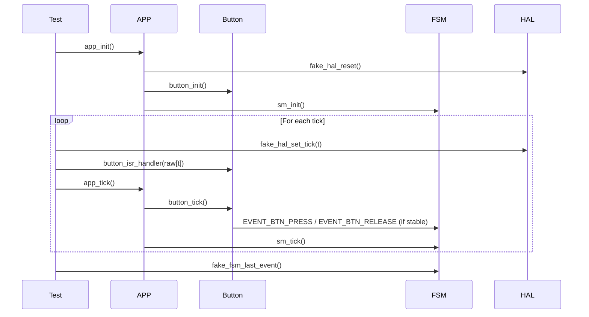

# TEST_SPEC_APP — Application Module Test Specification

## 1. Overview
This document defines the functional test specification for the `app` module.  
From it derive the parameterized unit tests:

- `test_app_tick_press_parameterized`
- `test_app_tick_release_parameterized`
- `test_app_init_parameterized`
- `test_app_tick_no_event_parameterized`
- `test_app_tick_bounce_parameterized`
- `test_app_tick_stable_no_new_event_parameterized`

These tests validate the integration between the button debounce module and the state machine through the application scheduler (`app_tick()`).

---

## 2. Functional Description

### 2.1 app_init()
`app_init()` must:
- Reset HAL tick and internal fake HAL state  
- Initialize the button module  
- Initialize the state machine  

This ensures a clean baseline before periodic execution begins.

### 2.2 app_tick()
`app_tick()` performs two actions:

1. **button_tick()**  
   - Processes raw ISR input  
   - Applies debounce  
   - Generates `EVENT_BTN_PRESS` or `EVENT_BTN_RELEASE`

2. **sm_tick()**  
   - Processes FSM transitions  
   - May generate additional events

### 2.3 app_run()
Runs an infinite loop calling `app_tick()`.  
Used only in production builds, not in unit tests.

---

## 3. Requirements

| Requirement ID | Description |
|----------------|-------------|
| REQ‑APP‑INIT‑01 | app_init() must reset HAL tick |
| REQ‑APP‑INIT‑02 | app_init() must initialize button state |
| REQ‑APP‑INIT‑03 | app_init() must not generate any button events |
| REQ‑APP‑TICK‑01 | app_tick() must propagate button press events |
| REQ‑APP‑TICK‑02 | app_tick() must propagate button release events |
| REQ‑APP‑TICK‑03 | app_tick() must call button_tick() exactly once |
| REQ‑APP‑TICK‑04 | app_tick() must call sm_tick() exactly once |
| REQ‑APP‑BTN‑01 | Debounce threshold must be respected (3 ticks) |
| REQ‑APP‑BTN‑02 | Events must be generated only after stable transitions |
| REQ‑APP‑BTN‑03 | Bounce must not generate events |
| REQ‑APP‑BTN‑04 | Stable state must not generate repeated events |

---

## 4. Test Cases

### 4.1 test_app_tick_press_parameterized
Validates:
- Correct propagation of `EVENT_BTN_PRESS`
- Debounce threshold respected
- FSM receives exactly one press event

#### Test Inputs

| Raw Sequence | Meaning |
|--------------|---------|
| `{1,1,1,1}` | ISR + 3 stable ticks → press |

#### Expected Output
- `fake_fsm_last_event() == EVENT_BTN_PRESS`

---

### 4.2 test_app_tick_release_parameterized
Validates:
- Correct propagation of `EVENT_BTN_RELEASE`
- Release only after a prior stable press
- Debounce threshold respected

#### Test Inputs

| Raw Sequence | Meaning |
|--------------|---------|
| `{0,0,0,0}` | ISR + 3 stable ticks → release |

#### Expected Output
- `fake_fsm_last_event() == EVENT_BTN_RELEASE`

---

### 4.3 test_app_init_parameterized
Validates:
- HAL tick reset
- Button state reset
- No events generated during initialization

#### Test Inputs

| Condition | Meaning |
|----------|---------|
| Dirty HAL tick | Must be reset to 0 |
| Dirty button raw level | Must be reset by init |

#### Expected Output
- `HAL_GetTick() == 0`
- `button_is_pressed() == false`

---

### 4.4 test_app_tick_no_event_parameterized
Validates:
- No events generated when raw level is stable
- Both stable 0 and stable 1 cases covered
- Stable 1 requires prior press

#### Test Inputs

| Raw Sequence | Meaning |
|--------------|---------|
| `{0,0,0,0,0}` | stable low → no event |
| `{1,1,1,1,1}` | stable high → no event (after press) |

#### Expected Output
- `fake_fsm_last_event() == EVENT_NONE`

---

### 4.5 test_app_tick_bounce_parameterized
Validates:
- Bounce resets debounce counter
- No events generated during unstable transitions

#### Test Inputs

| Raw Sequence | Meaning |
|--------------|---------|
| `{1,0,1}` | bounce → no event |
| `{0,1,0}` | bounce → no event |

#### Expected Output
- `fake_fsm_last_event() == EVENT_NONE`

---

### 4.6 test_app_tick_stable_no_new_event_parameterized
Validates:
- No repeated events when stable state remains unchanged
- Requires prior press to set stable_state = 1

#### Test Inputs

| Raw Sequence | Meaning |
|--------------|---------|
| `{1,1,1,1,1}` | stable high → no new event |

#### Expected Output
- `fake_fsm_last_event() == EVENT_NONE`

---

## 5. Traceability Matrix

| Requirement | Test Case |
|------------|-----------|
| REQ‑APP‑INIT‑01 | test_app_init_parameterized |
| REQ‑APP‑INIT‑02 | test_app_init_parameterized |
| REQ‑APP‑INIT‑03 | test_app_init_parameterized |
| REQ‑APP‑TICK‑01 | test_app_tick_press_parameterized |
| REQ‑APP‑TICK‑02 | test_app_tick_release_parameterized |
| REQ‑APP‑TICK‑03 | all app_tick tests |
| REQ‑APP‑TICK‑04 | all app_tick tests |
| REQ‑APP‑BTN‑01 | press, release |
| REQ‑APP‑BTN‑02 | press, release, no_event |
| REQ‑APP‑BTN‑03 | bounce |
| REQ‑APP‑BTN‑04 | stable_no_new_event |

---

## 6. UML Sequence Diagram

---

## 7. Summary
This specification defines the expected behavior of the `app` module and its integration with the button debounce logic and FSM.  
It now includes full coverage for:

- Initialization behavior  
- Press event generation  
- Release event generation  
- Stable no-event conditions  
- Bounce handling  
- Prevention of repeated events  

The test suite provides complete functional validation of the application scheduler.
